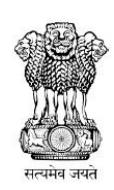

## **Vehicle Insurance Certificate**

## Registration Authority - Sikar Rto, Rajasthan

## **Registration No : RJ23CF9025**

Insurance Policy No. : 2367/75297560/00/000

Insurance Valid Upto : 11-Oct-2027

Insurance Company Name : Universal Sompo General Insurance Co. Ltd.

Insured Name : ASHISH YADAV

Insured Permanent Address : #BHANDALA, PO:, RAJPURA, RAJPURA, NEEM KA THANA,

Sikar-332718

Make & Model : XUV3XO MX3 PRO PM AT

Manufacturing (Month/Year) : 4/2024

Chassis Number : MA1NS2NWPR2D53098

Engine Number : NWRZD77653

Fuel Type : PETROL

Description of Vehicle : Motor Car(LMV)

Digitally signed on Date: 20/11/2024 09:38:34 IST

## **Note:**

- 1. This is a digital certificate. The format of this certificate may differ from document issued by the concerned department.
- 2. This certificate is generated by DigiLocker (https://digilocker.gov.in) directly from concerned department database.
- 3. This digitally signed document is legally valid as per the IT Act 2000 when used electronically.
- 4. To verify the print out of this certificate, download DigiLocker Android application from Google Play store and scan the QR code on the printed certificate.